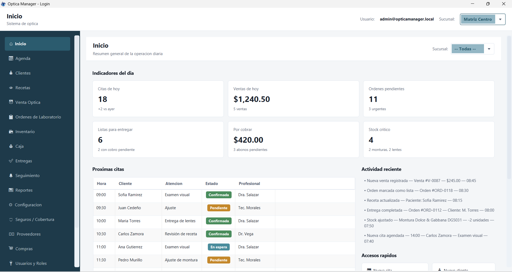
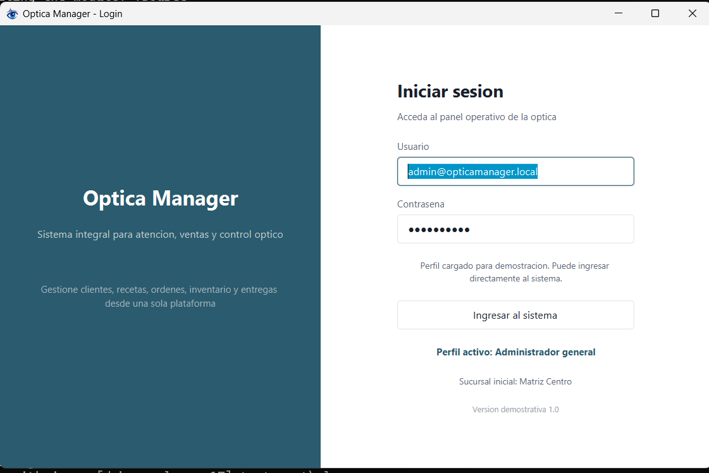

<p align="center">
  
</p>

<h1 align="center">OpticaDemo — Sistema Integral de Gestión Óptica</h1>

<p align="center">
  <strong>La herramienta definitiva para optometristas que quieren controlar todo desde un solo lugar.</strong>
</p>

<p align="center">
  
  
  
  
</p>

---

## ¿Qué es OpticaDemo?

**OpticaDemo** es el sistema de escritorio que toda óptica profesional necesita. Nació como proyecto de ingeniería en computación con una misión clara: **digitalizar la gestión completa de una óptica** — desde la primera cita del paciente hasta la entrega del trabajo de laboratorio — con una interfaz moderna, intuitiva y 100% en español.

Olvídate de las hojas de cálculo, los papeles perdidos y los post-its. Con OpticaDemo tenés **19 módulos especializados** que cubren cada rincón de tu negocio óptico.

## Capturas de Pantalla

### Pantalla de Inicio
> Dashboard principal con alertas, KPIs y accesos rápidos

<p align="center">
  
</p>

### Inicio de Sesión
> Acceso seguro con selección de usuario y sucursal

<p align="center">
  
</p>

## Funcionalidades

### 👥 Gestión de Clientes
Fichas integrales con historial, recetas vigentes, estado de coberturas y seguimiento completo de cada paciente.

### 📅 Agenda Inteligente
Programación de citas, recordatorios automáticos y vista diaria/semanal del flujo de trabajo.

### 🔬 Laboratorio Externo
Cola de órdenes, seguimiento por etapas (recepción → producción → control → envío → entrega), gestión de incidencias y retrabajos.

### 🏪 Inventario
Catálogo de monturas, lentes, accesorios y productos. Control de stock con alertas de reposición automática.

### 💰 Caja y Cobros
Cobro de órdenes, abonos a saldos, comprobantes, cierre de caja diario e histórico de pagos.

### 📦 Entregas
Bandeja de trabajos listos, gestión de entregas pendientes y notificaciones al cliente.

### 📊 Reportes Gerenciales
Resumen ejecutivo, ventas por estado, productos más vendidos, métricas de laboratorio y alertas de negocio.

### 🛡️ Coberturas y Seguros
Verificación de garantías, coberturas activas y alertas de vencimiento.

### ⚙️ Configuración
Sucursales, usuarios, roles, permisos y personalización completa del sistema.

## Los 19 Módulos

| # | Módulo | Qué hace |
|---|--------|----------|
| 1 | **Inicio** | Dashboard con alertas, KPIs y accesos rápidos |
| 2 | **Agenda** | Citas, recordatorios y calendario |
| 3 | **Clientes** | Fichas, recetas e historial |
| 4 | **Recetas** | Historial de recetas ópticas |
| 5 | **Venta Óptica** | Punto de venta integral |
| 6 | **Órdenes Lab** | Gestión de laboratorio externo |
| 7 | **Inventario** | Catálogo y stock |
| 8 | **Caja** | Cobros, abonos y cierre |
| 9 | **Entregas** | Trabajos listos y entregas |
| 10 | **Seguimiento** | Casos post-venta y recall |
| 11 | **Reportes** | Métricas y estadísticas |
| 12 | **Configuración** | Preferencias del sistema |
| 13 | **Seguros** | Coberturas y garantías |
| 14 | **Proveedores** | Directorio de proveedores |
| 15 | **Compras** | Órdenes de compra |
| 16 | **Usuarios/Roles** | Gestión de acceso |
| 17 | **Taller** | Trabajo técnico interno |
| 18 | **Notificaciones** | Centro de alertas |
| 19 | **Sucursales** | Multi-sucursal |

## Tecnología

| Capa | Tecnología |
|------|------------|
| **Lenguaje** | Java 17 |
| **UI Framework** | JavaFX 21 |
| **Vistas** | FXML + CSS personalizado |
| **Build Tool** | Maven 3.9 |
| **Arquitectura** | MVC + Facade + In-Memory Store |
| **Empaquetado** | jpackage (MSI nativo Windows) |

## Instalación Rápida

### Opción 1: Instalador MSI (Recomendado)

1. Descargá el archivo **`OpticaDemo-1.0.0.msi`** de la carpeta `assets/`
2. Hacé doble clic para instalar
3. ⚠️ Si Windows muestra *"Windows protegió tu PC"*:
   - Hacé clic en **"Más información"**
   - Hacé clic en **"Ejecutar de todos modos"**
4. Seguís el asistente y ¡listo!

### Opción 2: Desde código fuente

```bash
git clone https://github.com/marcos-moreira-dev/optica-blueprint.git
cd optica-blueprint/desktop
mvn clean javafx:run
```

### Opción 3: Crear tu propio instalador

```bash
cd desktop
build-installer.bat
```

## Estructura del Proyecto

```
optica-blueprint/
├── assets/                      # Logo, capturas e instalador
│   ├── logo.png
│   ├── pantalla-inicio.png
│   ├── login.png
│   └── OpticaDemo-1.0.0.msi
├── desktop/                     # Aplicación JavaFX
│   ├── src/main/java/           # Código fuente (~160 clases)
│   ├── src/main/resources/      # FXML, CSS, recursos
│   ├── pom.xml
│   └── build-installer.bat
├── planificación/               # Documentos de diseño
│   └── *.md                     # Blueprints de cada módulo
└── .gitignore
```

## Autor

**Marcos Moreira** · Estudiante de Ingeniería en Computación

> *"Construido con pasión para demostrar que la tecnología puede transformar la gestión óptica."*

## Licencia

Proyecto educativo de código abierto. Uso libre para aprendizaje y demostración.

---

<p align="center">
  <sub>Hecho con ☕ Java y ❤️ para la comunidad óptica</sub>
</p>
